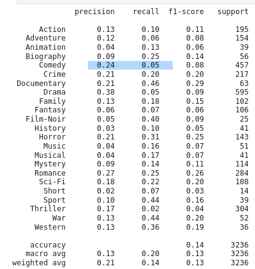
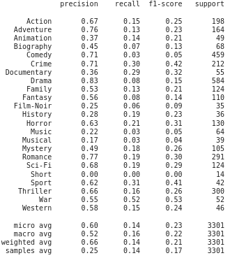

 # Informe de salida

## Resumen Ejecutivo

## Resultados del proyecto

- En este proyecto se logro comprender la base de datos de la películas y extraer las características de la trama; con ellas generar 2 modelos de clasificación que entreguen la probabilidad de que según la trama de una película se logre dar porcentajes de que esa película pertenezca a ese género cinematografico. El modelo base fue una regresión logística y el modelo final fue una red neuronal. Además, se hizo un despliegue mediante FastAPI del modelo de clasificación, el cual se puede desplegar local mediante uvicorn e instalando ciertas librerias. Este despliegue recibe un archivo json con la trama de la película y entrega las probabilidades de que la trama pertezca a 23 géneros cinematograficos.
  
- En cuanto desempeño, el modelo base tiene roc auc con promedio macro  y multiclase uno vs el resto de clases, un puntaje de 0.767 mientras que el modelo final un puntaje de 0.805. Cabe resaltar que para la evaluación de ambos modelos se quito el généro de News por ser muy pequeño, ya que solo contaba con 7 instancias, y que siempre estaba acompañado por  el género Documentary, por lo que no se perdia información relevante del modelo al quitarlo.
  
- Así mismo, como el roc auc fue mejor en la red neuronal que la regresión logística, tambíen lo fueron los F1 score de cada una de las clases ya que la clase que mejor se clasificó en la regresión fue la Documentary con un F1 Score de 0.29 y la peor fue Short con 0.03, mientras que la red neuronal tuvo como mejor puntaje el género de Sport con 0.41 y como peor puntaje Short con 0.0. Por otro lado, casi todas las clases tuvieron tuvieron mejor puntaje con la red neuronal que con la regresión logística excepción de la Comedia, Música y Músical donde fue ligeramente deficiente y esto se muestra en la siguiente tabla.

| Modelo Base   | Modelo Final  |
| -------- | ------------- |
|   |  | 

  

## Lecciones aprendidas

- El primer reto de este proyecto fue el problema de clasificación en sí, al ser de clases desbalanceadas, complico el entrenamiento de los modelos. Debido a esta dificultad se aprendio a colocar pesos según la frecuencia de cada clase y en el caso del modelo de red neuronal se desarrollo una función de costo hecha a medida apra un problema multiclase desbalanceado.
- El segundo reto fue la corta duración del proyecto, esto impidio una investigación y búsqueda de modelos, preprocesamiento y embbeding más exhaustiva. Sin embargo, esto ayudo a buscar soluciones prácticas y rápidas de implemenatar con tal de satisfacer las demandas del cliente.

## Impacto del proyecto

- El modelo ayuda a automatizar el etiquetado de películas según el género al que pertenece haciendo más ágil la documentación de nuevas películas, su lanzamiento en medio para su publicidad, ahorrando tiempo y dinero.
- Con respecto al modelamiento, se pudo haber hecho un análisis de cluster para agrupar varias clases en un grupos de significado similar, y con ello obtener mayor número de datos y clases ḿas balancedas haciendo más interpretable y fácil el entremaniento el modelo de clasificación
- Con más tiempo, se hubiese podido investigar, probar e implementar un embedding de procesamiento de lenguaje natural ya entrenado es decir, que extrajera la semántica delos textos; esto hubiese permitido  mejorar la extracción de características y mejorar la precisión de los modelos.

## Conclusiones

- Mirando los resultados de los reportes de clasificación, se puede ver que el modelo base tiene un desempeño pobre en cuanto al F1-score, mientras que el modelo final tiene mejores resultados en el F1 score, ya que supera la precisión  y es similar en el puntaje del recall al modelo base. Esto implica que el modelo hace menos predicciones que el modelo base, pero es más preciso y por lo tanto confiable.
- Se logro un puntaje de roc auc macro average ovr de 0.805 en el modelo final frente a un 0.767 del modelo base, es decir un 0.037 mejor. Cabe resaltar que al ser un problema multiclase de 23 catégorias sumamente desbalanceado, esto es un buen resultado, superando la medida del azar de 0.5.
- El modelo se puede desplegar en local o en la red, ya que todas sus librerías se puede instalar con pip y no es muy complejo su implementación,
- El modelo es útil, confiable y fácil de usar.
  

## Agradecimientos

- Agradecimientos la Universidad Nacional por sus enseñanzas.

