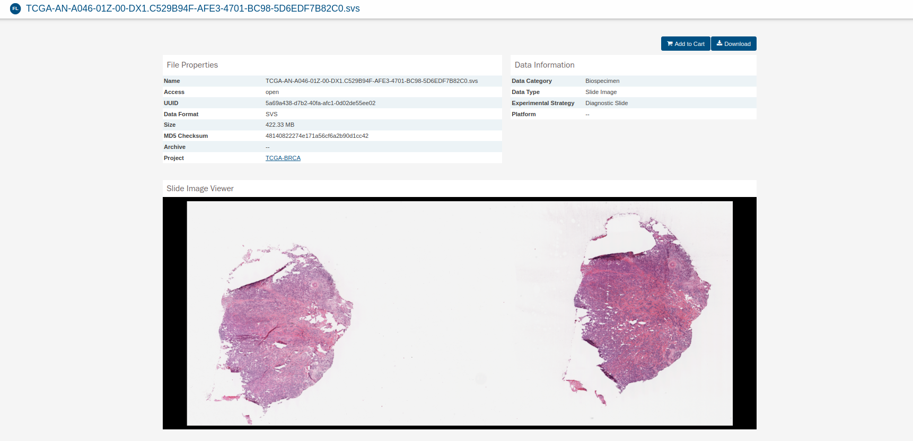

# Project Charter - Entendimiento del Negocio

## Nombre del Proyecto

Estimación de tiempo de sobrevivencia en casos de cáncer de seno triple negativo.

## Objetivo del Proyecto

El objetivo de este proyecto es entrenar, validar y desplegar un modelo de *deep learning* que use como insumo imágenes de histopatología de paciente con cáncer de seno triple-negativo confirmado para calcular su curva de sobrevivencia.

## Alcance del Proyecto

### Incluye:

- **Descripción de los datos disponibles:**

Para el desarrollo del proyecto se utilizará el conjunto de datos reportado en *The cnacer genome atlas* (TCGA), disponible en: https://portal.gdc.cancer.gov.  Cuenta con un total de 9121 casos, donde se incluye tiempos hasta la falla, indicador de evento e imágenes histopatologicas en múltiples  amplitudes ópticas en formato SVS.

En la siguiente imagen se puede observar los datos presentes para cada caso:

- [Descripción de los resultados esperados]
- [Criterios de éxito del proyecto]

### Excluye:

- [Descripción de lo que no está incluido en el proyecto]

## Metodología

[Descripción breve de la metodología que se utilizará para llevar a cabo el proyecto]

## Cronograma

| Etapa | Duración Estimada | Fechas |
|------|---------|-------|
| Entendimiento del negocio y carga de datos | 2 semanas | del 1 de mayo al 15 de mayo |
| Preprocesamiento, análisis exploratorio | 4 semanas | del 16 de mayo al 15 de junio |
| Modelamiento y extracción de características | 4 semanas | del 16 de junio al 15 de julio |
| Despliegue | 2 semanas | del 16 de julio al 31 de julio |
| Evaluación y entrega final | 3 semanas | del 1 de agosto al 21 de agosto |

Hay que tener en cuenta que estas fechas son de ejemplo, estas deben ajustarse de acuerdo al proyecto.

## Equipo del Proyecto

- [Nombre y cargo del líder del proyecto]
- [Nombre y cargo de los miembros del equipo]

## Presupuesto

[Descripción del presupuesto asignado al proyecto]

## Stakeholders

- [Nombre y cargo de los stakeholders del proyecto]
- [Descripción de la relación con los stakeholders]
- [Expectativas de los stakeholders]

## Aprobaciones

- [Nombre y cargo del aprobador del proyecto]
- [Firma del aprobador]
- [Fecha de aprobación]
