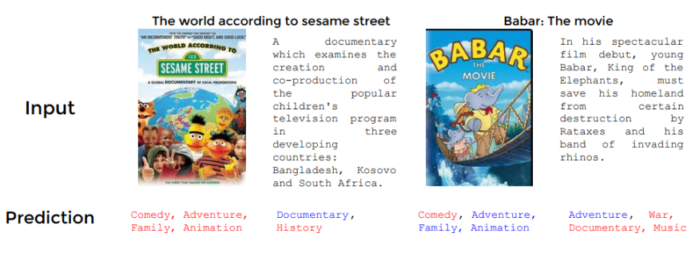
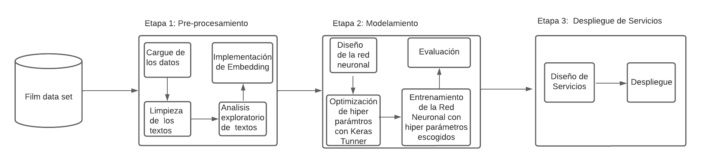

# Project Charter - Entendimiento del Negocio

## Clasificador de Géneros de Películas

Estimación de  la probabilidad de que dado el resumen de una película, esta pertenezca 24 de géneros cinematograficos .

## Objetivo del Proyecto

El objetivo de este proyecto es entrenar, validar y desplegar un modelo de *deep learning* que use como insumo el resumen de una película para calcular la probabilidad por cada genéro del cine de que la película sea clasificada en ese genéro.
## Alcance del Proyecto

### Incluye:

- **Descripción de los datos disponibles:**

Para el desarrollo del proyecto se utilizará el conjunto de datos reportado en el paper https://arxiv.org/abs/1702.01992 hecho por el profesor Fabio González, Ph.D. y a su alumno John Arevalo. Este dataset es un archivo plano csv que cuenta con 7895 registros donde se incluye el año de publicación de la película, su título y el resumen de la trama.

En la siguiente imagen se puede observar los datos presentes para cada caso:

- **Descripción de los resultados esperados:**

Se espera el despliegue de dos artefactos, el primero  son la gráficas de la metricas de error de predicción por cada genéro cinematografico y el segundo el despliegue de un servicio que dado el resumen de una película genere una lista de 24 valores entre 0 y 1 que suma sea 1 que se interprete como la probabilidad de que la película sea clasificada en ese genéro.

- **Criterios de éxito del proyecto**

Para que el proyecto sea culminado con éxito se requiere:

    - Un modelo que supere el rendimiento aleatorio con la metrica ROC_AUC macro average ovr, es decir mayor a 0.5.
    - Un servicio que procese resúmenes de películas y que entregue la probabilidad qde clasificar la película en 23 posibles genéros.

## Metodología

En el siguiente diagrama se muestra la metodología usada

## Cronograma

| Etapa | Duración Estimada | fechas |
|------|---------|-------|
| Etapa 1 | 10 días | del 1 de junio al 10 de junio  |
| Etapa 2 | 10 días | del 10 de junio al 20 de junio |
| Etapa 3 | 10 días | del 20 de junio al 30 de julio |

## Equipo del Proyecto

- Néstor Andrés Pachón Bermeo.

## Presupuesto

## Stakeholders

- Pepito Perez, Director de automatización y digitalización de Cine Colombia
- Área de  automatización y digitalización de Cine Colombia.
- [Descripción de la relación con los stakeholders]
- Despliegue de un modelo de Deep Learning que automatice el etiquetado de géneros de peliculas

## Aprobaciones

- [Nombre y cargo del aprobador del proyecto]
- [Firma del aprobador]
- [Fecha de aprobación]
