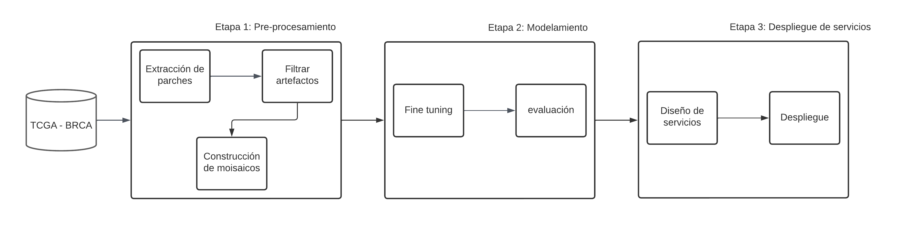
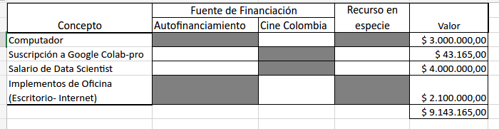

# Project Charter - Entendimiento del Negocio

## Nombre del Proyecto

Estimación de tiempo de sobrevivencia en casos de cáncer de seno triple negativo.

## Objetivo del Proyecto

El objetivo de este proyecto es entrenar, validar y desplegar un modelo de *deep learning* que use como insumo imágenes de histopatología de paciente con cáncer de seno triple-negativo confirmado para calcular su curva de sobrevivencia.

## Alcance del Proyecto

### Incluye:

- **Descripción de los datos disponibles:**

Para el desarrollo del proyecto se utilizará el conjunto de datos reportado en *The cnacer genome atlas* (TCGA), disponible en: https://portal.gdc.cancer.gov.  Cuenta con un total de 9121 casos, donde se incluye tiempos hasta la falla, indicador de evento e imágenes histopatologicas en múltiples  amplitudes ópticas en formato SVS.

En la siguiente imagen se puede observar los datos presentes para cada caso:

- **Descripción de los resultados esperados:**

Se espera el despliegue de dos servicios, uno que permita pre-procesar las imágenes histopatologías y otro que permita realizar estimación de tipo tiempo-evento empleando la representación obtenida por el servicio anterior.

- **Criterios de éxito del proyecto**

Para que el proyecto sea culminado con éxito se requiere:

    - Un modelo que supere el rendimiento aleatorio en el índice de concordancia.
    - Un servicio que procese las imágenes histopatologicas.
    - Un Servicio que permita hacer inferencias en base de las imagenes procesadas.

### Excluye:

Para el desarrollo del proyecto se replicará la línea base presentada por  Xinliang Zhu (disponible: https://openaccess.thecvf.com/content_cvpr_2017/papers/Zhu_WSISA_Making_Survival_CVPR_2017_paper.pdf), por lo cual no se realizara una optimización del modelo ni de sus hiperparamteros.

## Metodología

En el siguiente diagrama se muestra la metodología usada

## Cronograma

| Etapa | Duración Estimada |
|------|---------|-------|
| Etapa 1 | 2 semanas | del 1 de juanio al 15 de junio |
| Etapa 2 | 2 semanas | del 15 de junio al 30 de junio |
| Etapa 3 | 2 semanas | del 30 de junio al 15 de julio |

Hay que tener en cuenta que estas fechas son de ejemplo, estas deben ajustarse de acuerdo al proyecto.

## Equipo del Proyecto

- Juan Sebastaian Malagón Torres.

## Presupuesto

## Stakeholders

- [Nombre y cargo de los stakeholders del proyecto]
- [Descripción de la relación con los stakeholders]
- [Expectativas de los stakeholders]

## Aprobaciones

- [Nombre y cargo del aprobador del proyecto]
- [Firma del aprobador]
- [Fecha de aprobación]
