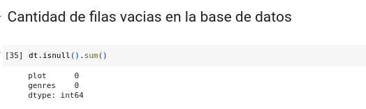
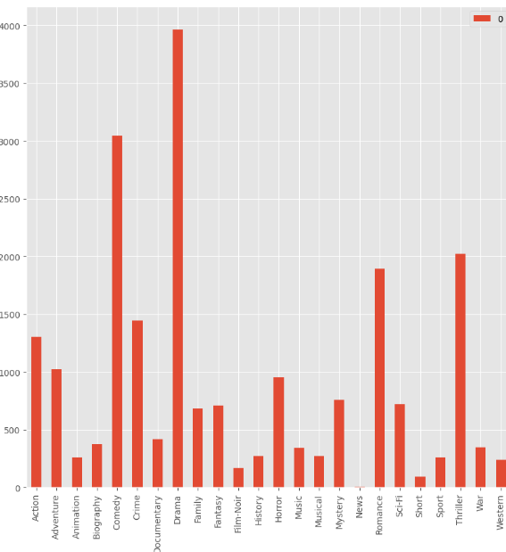
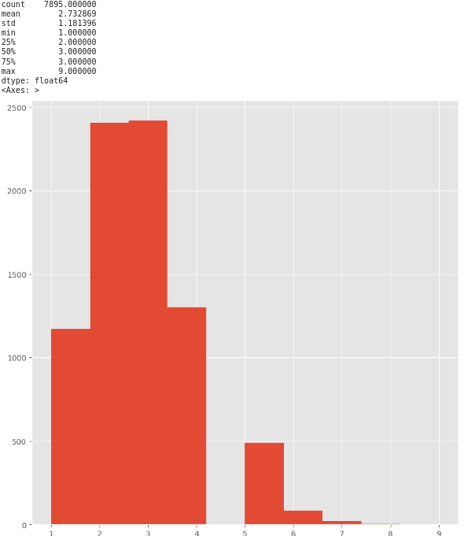
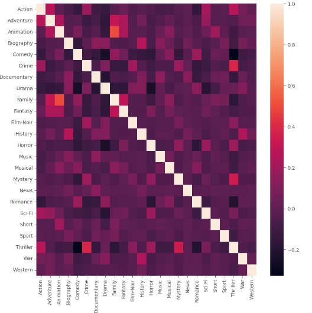
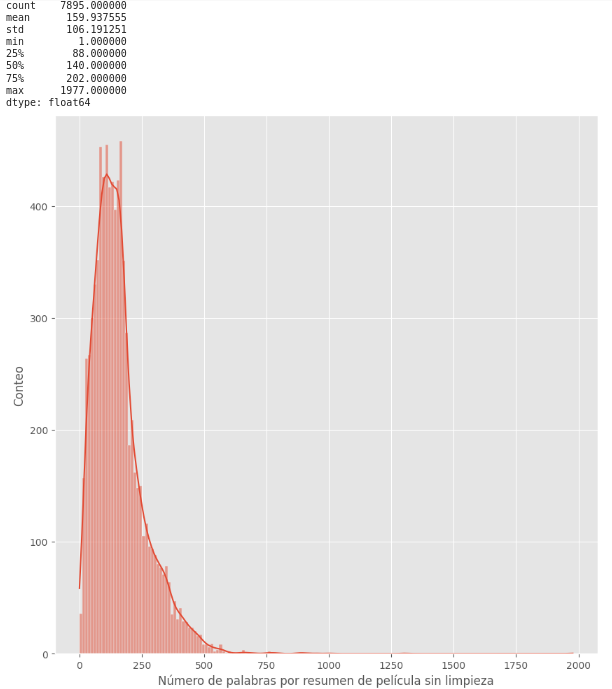
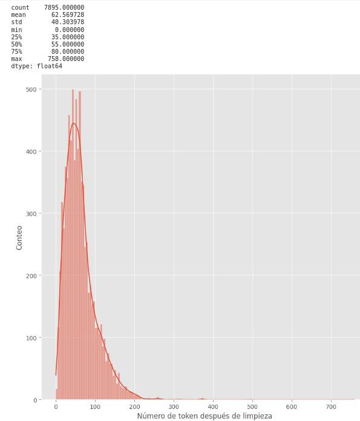
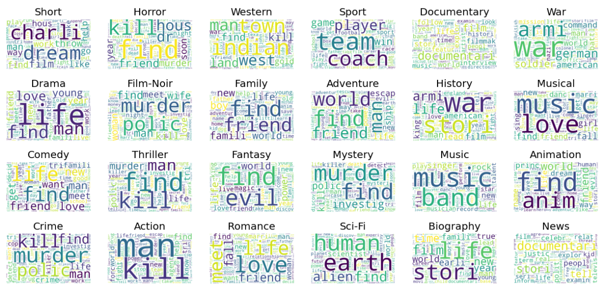

# Reporte de Datos

## Resumen general de los datos

En general la base de datos está compuesta por 5 variables, pero para nuestro proyecto en cuestión solo vamos a usar:
 - plot: resumen en inglés de la trama de película
 - genre: string que contiene los géneros a los cuales la película puede ser clasificada.

## Resumen de calidad de los datos

En esta base de datos no se tiene problemas de datos faltantes.

## Variable objetivo

La variable objetivo en este caso es categórica, y son los géneros cinematografico.Hay 24 de ellos y una misma película puede tener más de un género. En la siguiente imagen se ve la frecuencia que aparece un género en una película.

 

También, se puede ver que en a cada película se le asocian 2.7 géneros y qe como máximo se le asocian 9.

 

Así mismo, se evidencia de que las variables categóricas no evidencian una gran correlación entres sí, como se muestra en la siguiente gráfica.

 

## Variables individuales

La variable predictora es solo una, el plot de cada película sin embargo, para poder realizar un modelo de clasificación se debe limpiar el texto de palabras o elementos que no aporten a la predicción de los géneros. Despúes, mediante el algoritmo de embedding de sklearn TfidfVectorizer, convertimos el texto en una variable de texto a una matriz númerica que permite trabajar con modelos de deep learning.

Aquí se muestra la cantidad de palabras por texto sin limpieza.

 

y con limpieza de textos.

 

Se observa claramente que se reduce en 61% la cantidad de palabras por resumen, haciendo más eficiente el proceso de entrenamiento de un modelo de clasificación.

## Relación entre variables explicativas y variable objetivo

En esta sección debido a que es la relación de texto con categórias, se utilizará un word cloud para poder identificar facilmente cuales son las palabras más relevantes para cada género.

 
