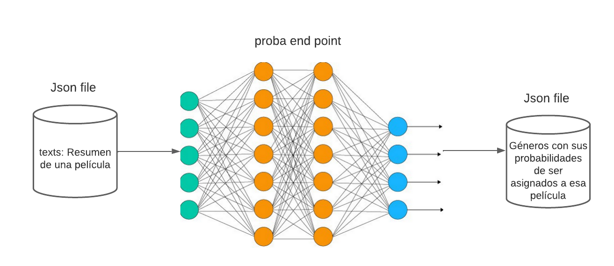

# Despliegue de modelos

## Infraestructura

- **Nombre del modelo:** Regresión de riesgos competitivos basada en el modelo de Cox.
- **Plataforma de despliegue:** El modelo será desplegado en un servidor local usando ngrok como método de apretura de puertos.
- **Requisitos técnicos:** 
    - *versión de Python:* python 3.11.3
    - *Librerias:* fastapi(0.98.0), json(2.0.9), numpy(1.24.3), tensorflow(2.12.0),  openslie(1.2.0), skimage(0.21.0), tensorflow_probability(0.20.1), concurrent, sys, tempfile
    - *Software:* Linux base OS (Manjaro Linux X86_64), kernel 6.1.31-MANJARO
    - *Hardware:* CPU: AMD Ryzen 5 5600X (12) @ 4.200GHz, GPU: NVIDIA GeForce RTX 3060, RAM: 31976 MiB
- **Requisitos de seguridad:** Al tratarse de datos previamente anonimizados bajo protocolo médico no es necesaria la encriptación.
- **Diagrama de arquitectura:**

## Código de despliegue

- **Archivo principal:** La aplicación diseñada está en el archivo *deploymentAPIs.py*
- **Rutas de acceso a los archivos:** El código puede encontrarse en *'src/nombre_paquete/deployment/deploymentAPIs.py'*

## Documentación del despliegue

- **Instrucciones de instalación:** Debe considerar la instalación de los paquetes asociados a openslide como a NVIDIA (CUDA, CUDNN). El resto de librerías mencionadas puede obtenerse por medio de pip. 
- **Instrucciones de configuración:** La mayoría de hiperparametros del modelo han sido explorados previamente y por consiguiente no se recomienda ninguna modificación sobre estos.
- **Instrucciones de uso:** El despliegue del modelo consta de dos pasos
    - *Despliegue del servidor:* Se pone en producción la aplicación creada, para ello ejecutar.
          - uvicorn {main_file_path}:app --reload 
    - *Apertura de puertos:* Para poder tener acceso a nuestro servicio desde cualquier punto debemos abrir el 8000, no obstante esto se encuentran normalmente restringidos por nuestro operado de internet, para evadir dichas limitaciones usamos el servicio de ngrok.
          - ./MLDS6project/src/nombre_paquete/preprocessing/ngrok http 8000
