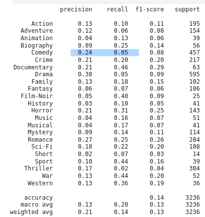

 # Reporte del Modelo Baseline

## Descripción del modelo

Como modelo base se toma una regresion logistica que toma como variables de entrada la matriz generada por el embedding TfidfVectorizer del las reseñas de la trama de peliculas y como salida un vector de los 23 géneros de cinemátograficos en formato dummies

## Variables de entrada

Son 280 variables extraidas del las tramas mediante el embedding TfidfVectorizer; las palabras que se seleccionaron de tal manera que estuviera en 95% de las tramas de las películas y como mínimo en un 3% de ellas.

Además, para mejorar la precisión del modelo y debido a la presentación de los datos, se genero un registro por cada généro que tuviera la película,ya que hay películas con más de un género

## Variable objetivo

Los genéros cinematográficos de las películas en formato multiclase.

Cabe resaltar que se eliminó la clase News de la variable objetivo debido a que solo 7 instancias y  de que siempre que está acompañada por el género Documentary.

## Evaluación del modelo

### Métricas de evaluación

La métrica ROC AUC (Área bajo la curva ROC) se utiliza para evaluar el rendimiento de un modelo en problemas de clasificación. En el caso de clasificación multiclase, donde se tienen más de dos clases, se puede utilizar el enfoque "average macro" para calcular la métrica ROC AUC.

En el enfoque "average macro", se calcula la curva ROC y el área bajo ella para cada clase individualmente. Luego, se toma el promedio de estas áreas para obtener el valor final del ROC AUC. Esto significa que se trata cada clase por igual y se promedia su rendimiento individual.

La curva ROC representa la tasa de verdaderos positivos (TPR) en función de la tasa de falsos positivos (FPR). Para cada clase, el modelo establece un umbral de probabilidad para decidir la clasificación, y se calcula el TPR y el FPR correspondientes para ese umbral. El área bajo la curva ROC es una medida de la capacidad del modelo para distinguir entre clases positivas y negativas.

En el enfoque "average macro", todas las clases tienen el mismo peso y se promedia su rendimiento individual. Esto es útil cuando se desea evaluar el rendimiento general del modelo en todas las clases de manera equitativa, sin importar si algunas clases tienen más muestras que otras. Sin embargo, es importante tener en cuenta que el enfoque "average macro" puede ocultar desequilibrios en el rendimiento de las clases individuales.

Finalmente el promedio se hace de sacar el ROC AUC para cada clase vs el resto de clases; esto se conoce como one vs resto o ovr.

## Análisis de los resultados

| metrica | valor  |
|------|---------|
| ROC_AUC AVERAGE OVR | 0.767 | 

### Reporte de Clasificación

## Análisis de los resultados

La teoria sobre el modelo dice que entre más próximo este el valor del área bajo la curva a 1, mejor sera el clasificador en distinguir las clase.
A modo de guía para interpretar las curvas ROC se han establecido los siguientes intervalos para los valores de AUC:
- [0.5], sería en nuestro caso como seleccionar el género de la pelicula al azar, como  sacar el género de una bolsa de papelitos a ciegas.
- [0.5  0.6) es malo
- [0.6 a 0.75) es regular
- [0.75 a 0.9) es bueno
- [0.9 a 0.97) es muy bueno
- [0.97 a 1) es excelente

Respecto a reporte de clasificación se puede ver que en general se tiene mejor  recall que precisión, esto quiere decir que el algoritmo logra encontrar las clases que pertenecen a las películas, no lo hace de la manera más exacta, se equivoca mucho, da muchos  falsos positivos géneros. Basicamente predice muchas clases a la vez y se equivoca mucho. Esto es visible  con Biografías y que tiene 9% de precisión, pero 25% de recall, con Film-Noir con 5% de precisión y 40% de recall.
  
Los géneros más precisos son el Romance, Horror, Drama y Comedia; y los que tiene mejor balance entre  recall y precisión , es decir los de mejor F1-score son el Romance, Horror y los Documentales.

## Conclusiones

- El clasificador base al tener un roc_auc de 0.76 alcanza a clasificar como bueno.
- El clasificador tiende a dar muchos falsos positivos y por eso se precisión es mala y su recally F1-score malos.
- Solo en géneros  con palabras muy únicas en su clase se comporta bien, como el caso de Romance o el Horror.
## Referencias

https://es.wikipedia.org/wiki/Curva_ROC)https://es.wikipedia.org/wiki/Curva_ROC
