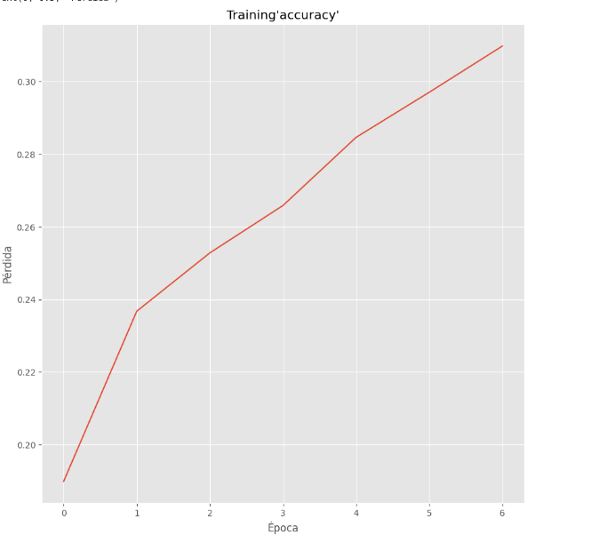
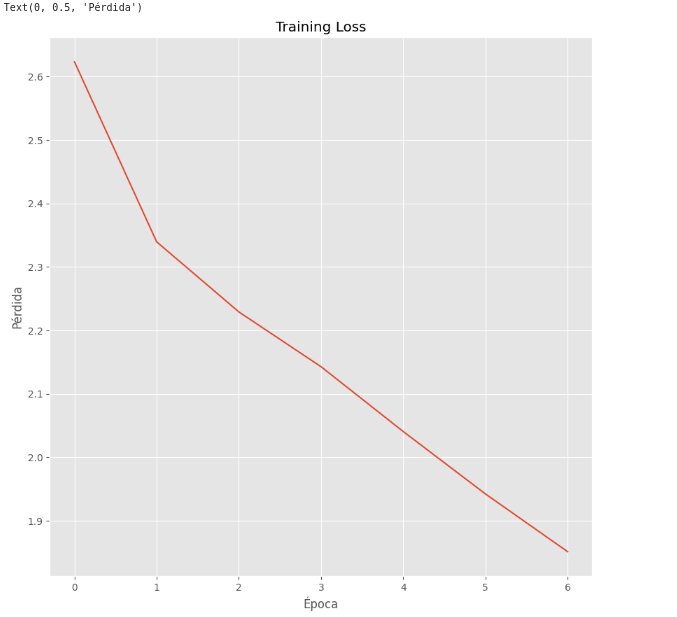
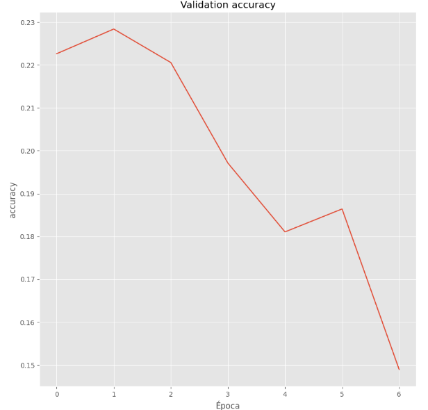
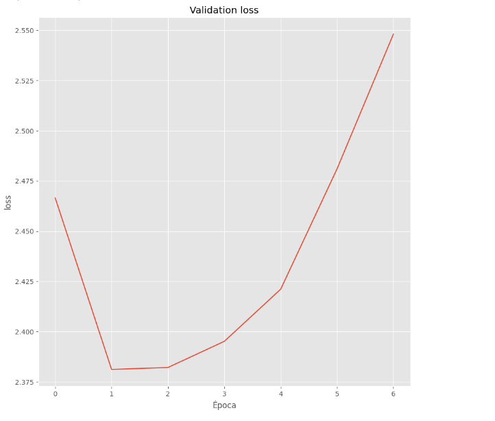

# Reporte del Modelo Final

## Resumen Ejecutivo

## Descripción del Problema

Debido a que este problema tiene como variables de entrada un cadena string de lenguaje natural y como salida varias clases, se necesita un modelo capaz de realizar abstracciones del texto y que a la vez puede identificar patrones en los texto y relacionarlo con varias  clases a la vez. Por eso se escogio como modelo final un red neuronal de 2 capas, ya que según el estado las redes neuronales,son las más usadas cuando se usan embedding como TfidfVectorizer, si se cuenta en gpu, son bastante rápidas y permiten mayor abstracción de los datos con el fin de clasificar un texto de la trama de una película de la manera más precisa posible y equitativa posible.

## Descripción del Modelo

Como respuesta a este problema se realizan varios cambios al modelo original:

Se decide aumentar la complejidad del modelo empleando una red neuronal multicapa, con una capa de entrada 280 neuronas; igual a la cantidad de palabras obtenidas por el embedding, 2 neuronas densas, una tras la otra que, despues de un procesos de optimización para encontrar los mejores párametros, entre ellos se tiene la que  cantidad de neuronas se encontro que la priera capa  interna debe ser 192 y de la segunda 64, una tasa se aprenizaje de 0.01.

Al igual que el modelo base se decidio quitar el género de News ya que solo tiene 7 películas clasificadas con este género

## Evaluación del Modelo

## Conclusiones y Recomendaciones

En con este modelo podemos ver que no se puede mejorar significativamente el ROC AUC con average macro y calculado una clase versus todas ya que el modelo base da un rendimiento de 0.767 y la red neuronal da  0.773, lo cual es una diferencia muy pequeña para el cambio de complejidad del modelo, tan solo de 0.6.

Por otro lado, el accuracy de validación llega a su pico maxímo muy rápido, lo que significa que el modleo se sobre ajusta muy rápido y tocaría cambiar de embedding por uno más grande y robusto o hacer más complejo la red neuronal con capas de neuronas más complejas

