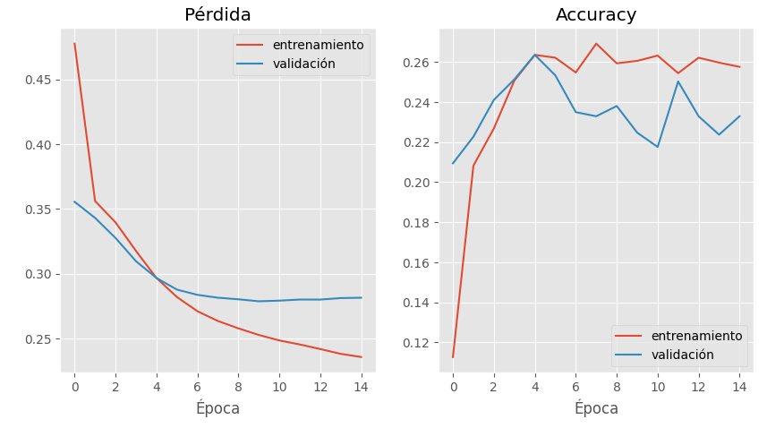
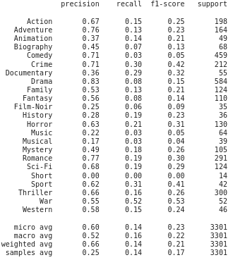

# Reporte del Modelo Final

## Resumen Ejecutivo

## Descripción del Problema

Debido a que este problema tiene como variables de entrada un cadena string de lenguaje natural y como salida varias clases, se necesita un modelo capaz de realizar abstracciones del texto y que a la vez puede identificar patrones en los texto y relacionarlo con varias  clases a la vez. Por eso se escogio como modelo final un red neuronal, ya que según el estado  del arte, las redes neuronales son las más usadas cuando se usan embedding como TfidfVectorizer; si se cuenta en gpu, son bastante rápidas y permiten mayor abstracción de los datos con el fin de clasificar un texto de la trama de una película de la manera más precisa posible y equitativa posible.

## Descripción del Modelo

Como respuesta a este problema se realizan varios cambios al modelo original:

Se decide aumentar la complejidad del modelo empleando una red neuronal, con una capa de entrada 280 neuronas; igual a la cantidad de palabras obtenidas por el embedding, 1 capa de neuronas densas, otra de Dropout para evitar el sobreajuste y una de salida de 23 neuronas, igual a la cantidad de géneros. Además, se programo una función de pérdida personalizada para el problema de clasificación multiclase desbalanceado; este es una extensión de la entropía cruzada binaria pero con más clases y se le añade pesos a error de clasificación de la clase según sea la frecuencia en la base de datos.

Al igual que el modelo base se decidio quitar el género de News ya que solo tiene 7 películas clasificadas con este género

## Evaluación del Modelo

### Entrenamiento de la red neuronal

Aquí se puede ver que la red se entrena muy rápido, con 6 épocas dejar de disminuir la función de pérdida y con 4 ya obtiene su máximo accuracy.

### Reporte de Clasificación

Se puede evidenciar que la red neuronal tiene mejor mejor precisión en las géneros de Aventura, Comedia, Crimen, Drama y  Romance, pero recall no son tan altos ya que el algoritmo no lanza tantas predicciones con una probabilidad mayor a 0.5, pero cuando lo hace es muy certero.

Además, los géneros con mejor F1-score son la Acción, Crimen, Documental, Misterio, Romance, el Sci-Fi, Thriller, Guerra y Deportes, ya que si bien tuvieron una precisión modesta, esas clases no son tan frecuentes como las de una buena precisión y por ende su recall es más elevado, es decir se encontro más predicciones verdaderas con respecto al total de instancias del género.

## Conclusiones y Recomendaciones

- El modelo de red neuronal es mejor que el modelo base en 3.7%.
- El modelo no lanza muchas probabilidades de clasificación mayores a 0.5 y por lo tanto no encuentra todas las clases, sin embargo cuando lo hace es preciso y confiable.
- Se hubiese podido investigar, probar e implementar un embedding de procesamiento de lenguaje natural ya entrenado es decir, que extrajera la semántica delos textos; esto hubiese permitido mejorar la extracción de características, utilizar capas más complejas como las LSTM que extraiga mejor los patrones y relaciones de las tramas con lo géneros  y mejorar el rendimiento del modelo.
- Por otro lado, el accuracy de validación llega a su pico maxímo muy rápido, lo que significa que el modelo se sobre ajusta muy rápido y tocaría cambiar de embedding por uno más grande y robusto o hacer más complejo la red neuronal con capas de neuronas más complejas.

